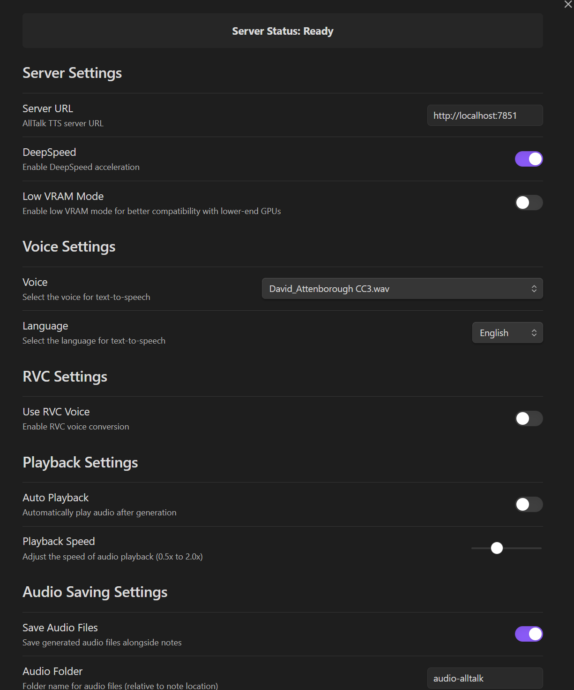

# Obsidian AllTalk TTS Plugin

This plugin integrates [AllTalk TTS](https://github.com/erew123/alltalk_tts/) with Obsidian, allowing you to use your local AllTalk TTS server to generate high-quality text-to-speech from your notes. It uses the XTTS-v2 engine, which can be fine-tuned to faithfully reproduce natural speech patterns. I also drew inspiration from the AllTalk-TTS implementation within [SillyTavern](https://github.com/SillyTavern/SillyTavern).

Obsidian-AllTalk-TTS enables generation of highlighted text or entire notes at once, with optional audio streaming or .wav file concatenation and saving. It is also possible to automatically embed the saved audio files within the markdown text.

## Features

### Text Selection and Full Note Reading
You can generate audio from either selected text or the entire note using the context menu:


*Right-click menu for selected text*


*Right-click menu for full note reading*

### Audio File Management
The plugin can automatically save generated audio files alongside your notes:


*Audio files are saved in a customizable folder next to your notes*

### Automatic Embedding
Generated audio can be automatically embedded in your notes for easy playback:


*Audio files are embedded directly in the note*

### Comprehensive Settings
The plugin offers extensive configuration options:


*Server configuration, voice selection, and RVC settings*


*Audio saving, playback, and text processing options*

## Prerequisites

1. Install and set up [AllTalk TTS](https://github.com/erew123/alltalk_tts/) on your computer
2. Ensure the AllTalk TTS server is running (default: http://localhost:7851)

## Installation

### Required Files

For manual installation, you need these files in your `.obsidian/plugins/obsidian-alltalk-tts/` folder:

```
obsidian-alltalk-tts/
├── main.js
├── manifest.json
└── styles.css
```

### From Obsidian Community Plugins (Not yet available)

1. Open Obsidian Settings
2. Go to Community Plugins and disable Safe Mode
3. Click Browse and search for "AllTalk TTS"
4. Install the plugin and enable it

### Manual Installation

1. Create a folder called `obsidian-alltalk-tts` in your vault's `.obsidian/plugins/` directory
2. Download `main.js`, `manifest.json`, and `styles.css` from the latest release
3. Place both files in the `obsidian-alltalk-tts` folder you created
4. Reload Obsidian
5. Enable the plugin in Community Plugins settings

### Building from Source

If you want to build the plugin yourself:

1. Clone the repository
2. Run `npm install` to install dependencies
3. Run `npm run build` to compile the plugin
4. Copy `main.js`, `manifest.json`, and `styles.css` to your vault's `.obsidian/plugins/obsidian-alltalk-tts/` folder

## Usage

### Commands

The plugin adds three commands that you can use:

1. **Read Highlighted Text**: Reads the currently selected text using AllTalk TTS
2. **Read Whole Page**: Reads the entire current note
3. **Stop Speech**: Stops the current speech playback

You can access these commands through:
- The Command Palette (Ctrl/Cmd + P)
- Custom hotkeys (can be set in Settings → Hotkeys)
- Context menus (right-click on text or note)

### Settings

Configure the plugin in Settings → AllTalk TTS:

- **Server Settings**:
  - Server URL for your AllTalk TTS instance
  - DeepSpeed acceleration toggle
  - Low VRAM mode for better GPU compatibility

- **Voice Settings**:
  - Select from available TTS voices
  - Choose text language
  - Optional RVC voice conversion

- **Audio Settings**:
  - Auto-playback toggle
  - Playback speed control
  - Audio file saving options
  - Custom folder for saved audio
  - Auto-embedding in notes

- **Text Processing**:
  - Narrator mode for text outside quotes
  - Skip codeblocks and tagged blocks
  - Handle asterisk content
  - Customize quote handling

## Support

- For plugin issues: [GitHub Issues](https://github.com/mithadon/obsidian-alltalk-tts-plugin/issues)
- For AllTalk TTS issues: [AllTalk TTS GitHub](https://github.com/erew123/alltalk_tts/issues)
